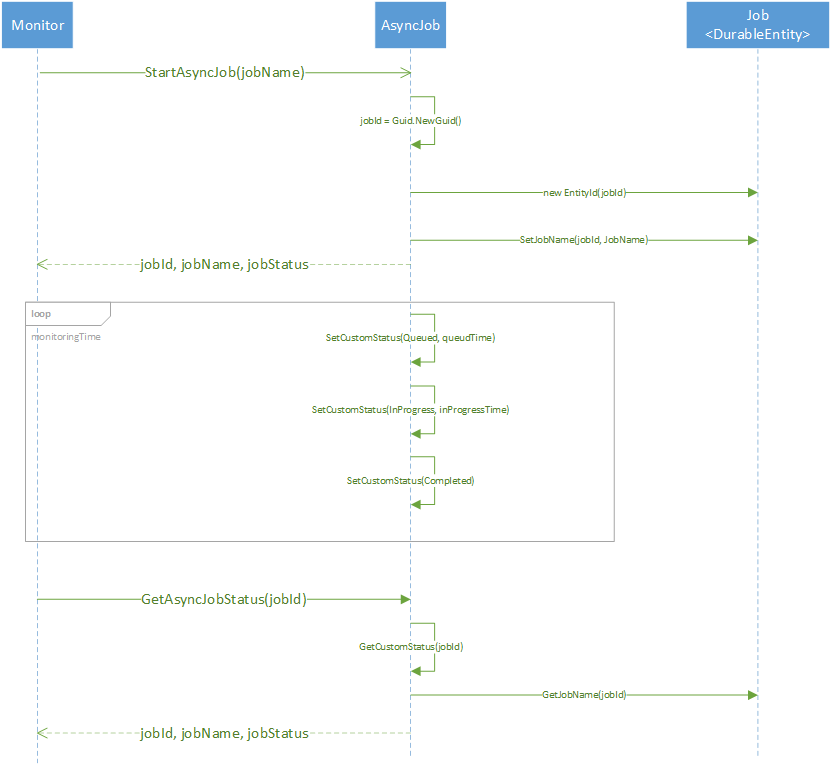
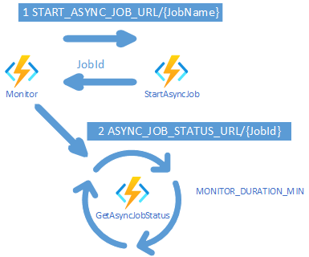
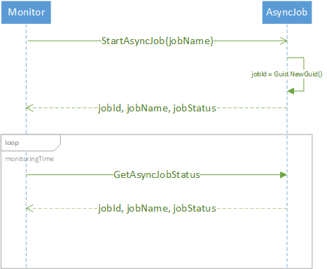

# Starting and monitoring long running async HTTP/REST requests

## Scenario overview. Contoso Books, Ltd

Contoso Books, Ltd. is a small but growing company that offers digital purchases of books. After being successful with their aggressive and creative advertising strategy and by providing an inventory that is comparable to what the larger online book stores offer, the decided to create a service analyzing the book reviews and returning the results to the publishers.

Contoso is using a cloud based hybrid extract-transform-load (ETL), extract-load-transform (ELT) services. These and other analytics services will be programmatically triggered via corresponding APIs from the self-service portal provided by Contoso to the book publishers. The ETL/ELT service is an asynchronous long running HTTP/REST operation providing a status endpoint for the progress monitoring. 

Contoso decided to use Azure Durable Functions Orchestrators since in their opinion, they are the best fit for implementing long-running or even perpetual orchestrations.

## Code Content

This example consists of two Durable Function orchestrators. One of the emulates the ETL/ELT service and the other one is the real monitoring orchestrator implementing the logic needed by Contoso.  
Although in this example both orchestrators run in the same Function App, they can run fully independently being deployed in different Function Apps.
 
### AsyncJob ETL/ELT service emulator
Instead of using a real ETL/ELT service, a mock service [AsyncJobOrchestrator](AsyncJob.cs) emulates this service with AsyncJobTrigger starting the ETL/ELT pipeline returning a generated JobId for the JobName provided. The status endpoint AsyncJobStatus returns the JobId and returns JobName, JobId and Job Status. 

It can be configured by the app settings "ASYNC_JOB_QUEUED_DURATION_SEC" and "ASYNC_JOB_INPROGRESS_DURATION_SEC" since it uses only 3 states during the execution: Queued, InProgress and Completed

The emulator logic is a bit more complex than the logic of the monitor since it needs to correlate the generated JobId with the JobName as the job gets started. As the Monitor will ask for status of the job with the JobId, it needs to find the JobName associated with the JobName. Instead of a Database, Durable Function Entities are used here.



### Monitor
The second orchestrator is exactly what Contoso needs to implement - it starts *and* monitors the ETL/ELT service pipeline execution being able to receive the current status  

The monitoring orchestrator solely needs the ETL/ELT service endpoints for triggering the pipeline processing "START_ASYNC_JOB_URL" and for the monitoring "ASYNC_JOB_STATUS_URL" configured in the app settings.





### Configuration and test

You can run the code locally inside Visual Studio Code as described [here](https://learn.microsoft.com/en-us/azure/azure-functions/durable/durable-functions-create-first-csharp?pivots=code-editor-vscode)

For the local configuration you will need to create a local.settings.json file with the following content:
```json
{
  "IsEncrypted": false,
  "Values": {
    "AzureWebJobsStorage": "UseDevelopmentStorage=true",
    "FUNCTIONS_WORKER_RUNTIME": "dotnet",
    "START_ASYNC_JOB_URL" : "http://localhost:7071/api/job-start",
    "ASYNC_JOB_STATUS_URL" : "http://localhost:7071/api/job-status",
    "ASYNC_JOB_QUEUED_DURATION_SEC" : 2,
    "ASYNC_JOB_INPROGRESS_DURATION_SEC" : 2,
    "MONITOR_DURATION_MIN" : 1,
    "MONITOR_POLLINGINTERVAL_SEC" : 20
  }
}
```
To trigger the orchestration, you can issue the following HTTP request:
```HTTP
GET http://localhost:7071/api/monitor-job/gb4711 HTTP/1.1
```    

